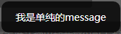
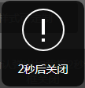
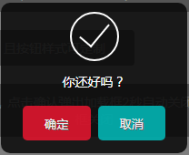

# Dialog-jq

基于jq写的一个面向对象移动端的dialog弹窗组件

## 如何写一个jq面向对象组件

关于如何写好一个jq组件/插件，网上很多例子，这里推荐一个<http://www.xuanfengge.com/jquery-plug-in-written-summary-and-summary-of-writing-object-oriented-manner.html>

## Examples

[:point_right: 在线demo查看效果 ](https://github.com/zhansingsong/react-lazyimg-component.git)

## 效果截图

#### 部分截图

  
  

## api

	
	

	var d = dialog({
		type: 'waiting', // 对话框类型 必选 可以为loading message waiting warning ok
        message: null, // 对话框提示信息
        buttons: null, // 按钮配置(确定,取消,无等)
        delay: null, // 对话框延时多少秒自动关闭(null不关闭)
        delayCallBack: null, // 延时关闭回调
        maskOpacity: null, // 遮罩透明度(null不设置透明度，为默认透明度)
        maskClose: false, // 点击mask是否关闭
		effect: false, // 是否开启动画
        width: 'auto', // 宽
        height: 'auto' // 高
	})

